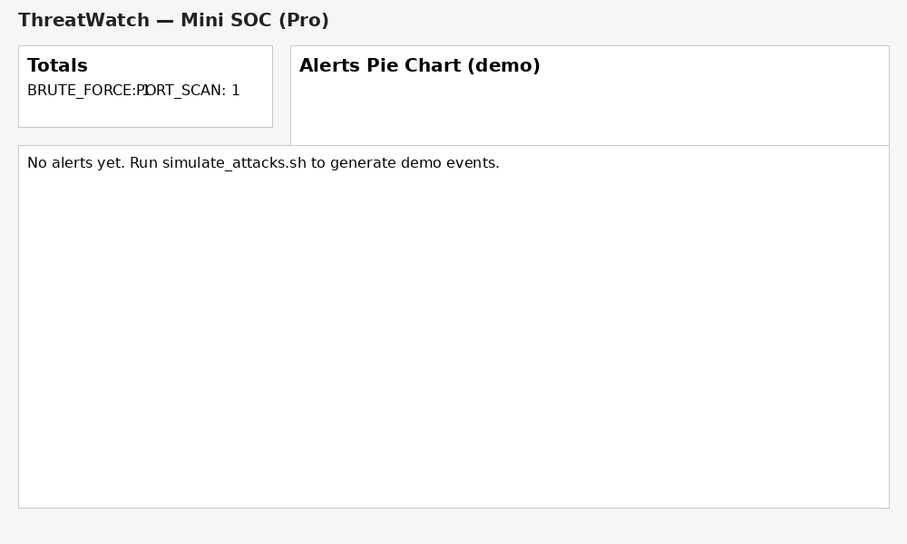
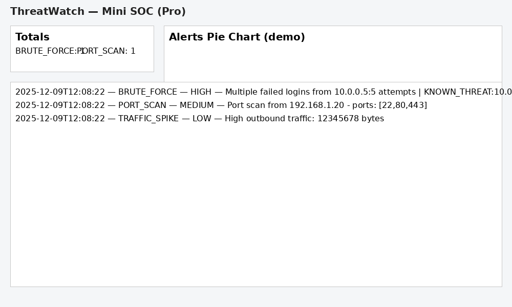

# ThreatWatch — Mini SOC (Pro Edition)
**Author:** Amanullah Khan  
**Tech:** Python · Flask · SQLite · Chart.js · Linux/WSL  
**Role Fit:** SOC Analyst Intern · Cyber Security Intern · Detection Engineering Trainee


## 📸 Demo Screenshots

### 🟦 Dashboard (Empty State)
This is how the Mini SOC dashboard looks before any alerts are generated:



---

### 🟥 Dashboard (With Alerts)
After running `simulate_attacks.sh` and collector, alerts appear with severity colors and threat-intel flags:



---

### 🎥 Live Demo GIF
Short animated preview of the dashboard updating in real time:


---

## 🧠 What is ThreatWatch?
**ThreatWatch is a lightweight, fully functional Mini-SOC platform** designed to demonstrate your understanding of SOC fundamentals:

- 🔍 Log ingestion & parsing  
- 🚨 Rule-based threat detection  
- 🔥 Threat Intelligence enrichment  
- 📊 Real-time dashboard (auto-updating)  
- 🧪 Unit tests for detection rules  
- 🛠️ Deployment-ready (Dockerfile included)

Perfect for internship interviews (like **Diolette Cyber Intern**) because it shows pipeline thinking, detection engineering ability, and security fundamentals.

---

## 🏗️ Architecture Overview

               ┌────────────────────────┐
               │   Simulated or System   │
               │         Logs            │
               └────────────┬───────────┘
                            │
                 (1) collector.py
                            │ parses
                            ▼
               ┌────────────────────────┐
               │     detector.py        │
               │ - brute force rules    │
               │ - port scan rules      │
               │ - traffic anomalies    │
               │ - threat intel lookup  │
               └────────────┬───────────┘
                            │ alerts
                            ▼
               ┌────────────────────────┐
               │       SQLite DB        │
               │       alerts table     │
               └────────────┬───────────┘
                            │ API
                            ▼
               ┌────────────────────────┐
               │        app.py          │
               │  Flask API + UI        │
               └────────────┬───────────┘
                            │ JSON
                            ▼
               ┌────────────────────────┐
               │   Dashboard (HTML/JS)  │
               │  Chart.js / Polling    │
               └────────────────────────┘

---

## ✨ Features (Pro Edition Highlights)
- 🟢 **Interactive Dashboard**  
  - Realtime alerts  
  - Severity filters  
  - Pie charts & counters  
  - Threat Intel badges  

- 🔴 **Threat Intelligence Integration**  
  - Known malicious IPs from `intel/blacklist.csv`  
  - Severity auto-escalation  
  - KNOWN_THREAT tagging  

- 🟡 **Detection Rules Implemented**
  - BRUTE_FORCE  
  - PORT_SCAN  
  - TRAFFIC_SPIKE  
  - KNOWN_THREAT severity bump  

- 🔵 **Demo Tools Included**
  - `simulate_attacks.sh`  
  - `simulate_attack_windows.bat`  

- 🧪 **Unit Tests (`pytest`)**  
- 🐳 **Dockerfile for production use**  

---

## 🚀 Quick Start (3 terminals)

### **Terminal 1 — Collector**
```bash
source venv/bin/activate
python -u collector.py
Terminal 2 — Dashboard
source venv/bin/activate
python -u app.py


Now open 👉 http://127.0.0.1:5000

Terminal 3 — Simulated Attacks
source venv/bin/activate
bash simulate_attacks.sh


This generates events which the collector converts into alerts.

📸 Dashboard Previews
🔵 Empty Dashboard (before events)

🔥 Dashboard with Alerts

🎥 Live Demo GIF

🔍 Detection Rules Explained
1. BRUTE_FORCE

Triggered when:

≥ BRUTE_FORCE_THRESHOLD failed logins

within DETECTION_WINDOW seconds

from the same IP.

Severity: HIGH

2. PORT_SCAN

Triggered when:

A scan event lists multiple ports from one IP.

Severity: MEDIUM (upgraded to HIGH if KNOWN_THREAT)

3. TRAFFIC_SPIKE

Triggered when:

Outbound traffic exceeds threshold.

Severity: LOW

4. KNOWN_THREAT (Threat Intel)

If an IP exists in intel/blacklist.csv, any event from that IP:

gets tagged KNOWN_THREAT:<ip>

severity escalates (e.g., MEDIUM → HIGH)

🧪 Tests (Detection Engine)

Run with:

pytest tests/test_detector.py -q


Covers:

Brute force rule

Port scan rule

Traffic anomaly rule

Threat intel escalation

🐳 Run via Docker (optional)
docker build -t threatwatch .
docker run -p 5000:5000 threatwatch

📂 Project Structure
ThreatWatch_Pro/
│ app.py
│ collector.py
│ detector.py
│ requirements.txt
│ Dockerfile
│ README.md
│ LICENSE.txt
│ simulate_attacks.sh
│ simulate_attack_windows.bat
│
├── templates/
├── static/
├── intel/
├── screenshots/
└── tests/

📜 License

MIT License — free for anyone to reuse.
Credit is appreciated but not required.
